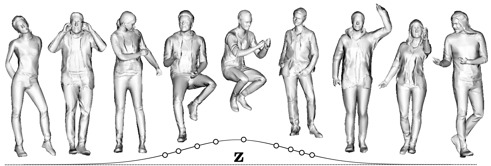

# gDNA: Towards Generative Detailed Neural Avatars
## [Paper](https://ait.ethz.ch/projects/2022/gdna/downloads/main.pdf) | [Video](https://youtu.be/uOyoH7OO16I) | [Project Page](https://xuchen-ethz.github.io/gdna/)

 


Official code release for CVPR 2022 paper [*gDNA: Towards Generative Detailed Neural Avatars*](https://ait.ethz.ch/projects/2022/gdna/downloads/main.pdf). We propose a model that can generate diverse detailed and animatable 3D humans. 

If you find our code or paper useful, please cite as
```
@inproceedings{chen2022gdna,
      title={gDNA: Towards Generative Detailed Neural Avatars},
      author={Chen, Xu and Jiang, Tianjian and Song, Jie and Yang, Jinlong and Black, Michael J and Geiger, Andreas and Hilliges, Otmar},    
      journal   = {IEEE Conf. on Computer Vision and Pattern Recognition (CVPR)},
      year      = {2022}
      }
```

**Note:** In the paper we trained our model with two commercial datasets, 3DPeople and RenderPeople. We haven't yet gotten permission to release a generative model trained with 3DPeople. Instead, we release a model trained with RenderPeople only, and also a model trained with a freely accessible dataset THuman2.0. In addition, the list of original training scans from 3DPeople and RenderPeople can be found in `lib/dataset/renderpeople_3dpeople.csv` in case one wants to buy them. 

# Quick Start
Clone this repo:
```
git clone https://github.com/xuchen-ethz/gdna.git
cd gdna
```

Install environment:
```
conda env create -f env.yml
conda activate gdna
python setup.py install
```

Download [SMPL models](https://smpl.is.tue.mpg.de) (1.0.0 for Python 2.7 (10 shape PCs)) and move them to the corresponding locations:
```
mkdir lib/smpl/smpl_model/
mv /path/to/smpl/models/basicModel_f_lbs_10_207_0_v1.0.0.pkl lib/smpl/smpl_model/SMPL_NEUTRAL.pkl
```

Download our pretrained models and test motion sequences: 
```
sh ./download_data.sh
```

Run one of the following command and check the result video in `outputs/renderpeople/video`


**"Dancinterpolation":** generate a dancing + interpolation sequence
```
python test.py expname=renderpeople +experiments=fine eval_mode=interp
```

**Disentangled Control:** change the coarse shape while keeping other factors fixed
```
python test.py expname=renderpeople +experiments=fine eval_mode=z_shape
```
To control other factors, simply change `eval_mode=[z_shape|z_detail|betas|thetas]`.

**Random Sampling:** generate samples with random poses and latent codes
```
python test.py expname=renderpeople +experiments=fine eval_mode=sample
```


**THuman2.0 Model:** run the following command with desired eval_mode for the model trained with THuman2.0
```
python test.py expname=thuman  model.norm_network.multires=6 +experiments=fine datamodule=thuman eval_mode=interp
```
Note that for this dataset we use more frequency components for the positional encoding (`model.norm_network.multires=6`) due to the rich details in this dataset. Also note that this THuman2.0 model exhibits less body shape (betas) variations bounded by the body shape variations in the training set.

# Training
We use THuman2.0 as an example because it's free. The same pipeline works also for commericial datasets, like 3DPeople and RenderPeople which is used to train our orignal model.

## Install Additional Dependencies
Install [kaolin](https://kaolin.readthedocs.io/en/latest/notes/installation.html) for fast occupancy query from meshes.
```
git clone https://github.com/NVIDIAGameWorks/kaolin
cd kaolin
git checkout v0.9.0
python setup.py develop
```

## Prepare Datasets

First, download [THuman2.0 dataset](https://github.com/ytrock/THuman2.0-Dataset) following their instructions. 

Also download the corresponding SMPL parameters:
```
wget https://dataset.ait.ethz.ch/downloads/gdna/THuman2.0_smpl.zip
unzip THuman2.0_smpl.zip -d data/
```

Next, run the pre-processing script to get ground truth occupancy, surface normal and 2D normal maps:
```
python preprocess.py --tot 1 --id 0
```
You can run multiple instantces of the script in parallel by simply specifying `--tot` to be the number of total instances and `--id` to be the rank of current instance. 

## Training
Our model is trained in two stages. First, train the coarse model
```
python train.py expname=coarse datamodule=thuman
```
This step takes around 12 hours on 4 Quadro RTX 6000 GPUs.

After the first stage finishes, run the following command to precompute 2D-3D correspondences using implicit renderer+ forward skinning
```
python precompute.py expname=coarse datamodule=thuman agent_tot=1 agent_id=0
```
This step is optional but highly recommanded because computing 2D-3D correspondences on the fly is very slow. You can run multiple instantces of the script in parallel by simply specifying `agent_tot` to be the number of total instances and `agent_id` to be the rank of current instance. 

Next, train the fine model
```
python train.py expname=fine datamodule=thuman +experiments=fine model.norm_network.multires=6
```
This step takes around 1.5 days on 4 Quadro RTX 6000 GPUs. 

Note that for THuman2.0 we recommand more frequency components for the positional encoding (`model.norm_network.multires=6`) due to the rich details in this dataset but this is optional.


Training logs are available on [wandb](https://wandb.ai/home) (registration needed, free of charge).

## Inference

Run one of the following command. Note that `model.norm_network.multires=6` needs to be modified to be consistent with the training of the fine model.

**"Dancinterpolation":** generate a dancing + interpolation sequence
```
python test.py expname=fine +experiments=fine datamodule=thuman eval_mode=interp model.norm_network.multires=6
```

**Disentangled Control:** change the coarse shape while keeping other factors fixed
```
python test.py expname=fine +experiments=fine datamodule=thuman eval_mode=z_shape model.norm_network.multires=6
```
To control other factors, simply change `eval_mode=[z_shape|z_detail|betas|thetas].

**Random Sampling:** generate samples with random poses and latent codes
```
python test.py expname=fine +experiments=fine datamodule=thuman eval_mode=sample model.norm_network.multires=6
```

The output videos are stored in `outputs/fine/video`.

# More Work on Neural Implicit Avatars
Here are some other works on neural implicit avatars from our group :)
* [Chen et. al. - SNARF: Differentiable Forward Skinning for Animating Non-rigid Neural Implicit Shapes](https://xuchen-ethz.github.io/snarf/)

* [Zheng et. al. - I M Avatar: Implicit Morphable Head Avatars from Videos](https://github.com/zhengyuf/IMavatar)

* [Dong et. al. - PINA: Learning a Personalized Implicit Neural Avatar from a Single RGB-D Video Sequence](https://zj-dong.github.io/pina/)

# Acknowledgement
We have used codes from other great research work, including [IGR](https://github.com/amosgropp/IGR), [IDR](https://github.com/lioryariv/idr), [NASA](https://github.com/tensorflow/graphics/tree/master/tensorflow_graphics/projects/nasa), [DEQ](https://github.com/locuslab/deq), [StyleGAN-Ada](https://github.com/NVlabs/stylegan2-ada-pytorch), [Occupancy Networks](https://github.com/autonomousvision/occupancy_networks), [SMPL-X](https://github.com/vchoutas/smplx), [ML-GSN](https://github.com/apple/ml-gsn/). We sincerely thank the authors for their awesome work!
